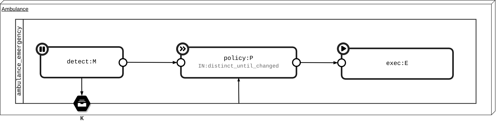

[![Issues][issues-shield]][issues-url]
[![GPL License][license-shield]][license-url]
[![Homie][rxpy-shield]][rxpy-url]
[![LinkedIn][linkedin-shield]][linkedin-url]

<p align="center">
  
  <h3 align="center">Decentralized Monitor Analyze Plan Execute Knowledge loops</h3>
  <p align="center">
    Software framework to support the development and deployment of Autonomous (Self-Adaptive) Systems
  </p>
</p>
<br />

## Getting Started

### Install

```bash
python -m venv venv
source venv/bin/activate
python -m pip install -r requirements.txt
```

### First loop (Ambulance)



```python
import mape
from mape.loop import Loop

""" MAPE Loop and elements definition """
loop = Loop(uid='ambulance_emergency')

@loop.monitor
def detect(item, on_next, self):
    if 'speed_limit' in item:
        # Local volatile knowledge
        self.loop.k.speed_limit = item['speed_limit']
    elif 'emergency_detect' in item:
        on_next(item['emergency_detect'])

@loop.plan(ops_in=ops.distinct_until_changed())
async def policy(emergency, on_next, self):
    if emergency is True:
        self.last_speed_limit = self.loop.k.speed_limit
        new_speed = max(self.last_speed_limit, self.emergency_speed)

        on_next({'speed': new_speed})
        on_next({'siren': True})
    else:
        on_next({'speed': self.last_speed_limit})
        on_next({'siren': False})

policy.emergency_speed = 160

@loop.execute
def exec(item: dict, on_next):
    if 'speed' in item:
        ambulance.speed_limit = item['speed']
    if 'siren' in item:
        ambulance.siren = item['siren']

for element in loop:
    element.debug(Element.Debug.IN)

""" MAPE Elements connection """
detect.subscribe(policy)
policy.subscribe(exec)

# Starting monitor...
detect.start()
```
### Traversing

```python
# Iterate over loops and element
for loop in mape.app:
    logger.debug(f"* {loop.uid}")
    for element in loop:
        logger.debug(f" - {element.uid}")

# Get all Execute elements
[element for element in loop_obj if isinstance(element, Execute)]

# Different access way to loop/element through dot-notation (path)
mape.app.loop_uid.element_uid
mape.app['loop_uid.element_uid']
```

## Docs

### Slides

TODO

### Examples

Implementation of the 5 decentralized (and distributed) MAPE patterns described in the paper:  
["On Patterns for Decentralized Control in Self-Adaptive Systems", Danny Weyns](https://www.ics.uci.edu/~seal/publications/2012aSefSAS.pdf)

* **Ambulance-Car Emergency** (Information Sharing and Coordinated Control)
* **Average Speed Enforcement** (Master/Slave)
* **Dynamic Carriageway** (Regional Planning)
* **Cruise Control with Distance Hold** (Hierarchical Control)

The examples could have need of a Redis and InfluxDB instance running.

```bash
docker run --name mape-redis -p 6379:6379  \
-v $(pwd)/docker/redis:/usr/local/etc/redis  \
--rm redis redis-server /usr/local/etc/redis/redis.conf
```

```bash
docker run --name mape-influxdb -p 8086:8086 \
-v $(pwd)/docker/influxdb/data:/var/lib/influxdb2 \
-v $(pwd)/docker/influxdb/conf:/etc/influxdb2 \
-e DOCKER_INFLUXDB_INIT_MODE=setup \
-e DOCKER_INFLUXDB_INIT_USERNAME=user \
-e DOCKER_INFLUXDB_INIT_PASSWORD=qwerty123456 \
-e DOCKER_INFLUXDB_INIT_ORG=univaq \
-e DOCKER_INFLUXDB_INIT_BUCKET=mape \
-e DOCKER_INFLUXDB_INIT_RETENTION=1w \
-e DOCKER_INFLUXDB_INIT_ADMIN_TOKEN=<GENERATE_OR_USE_TOKEN_IN_CONFIG_YAML> \
--rm influxdb:2.0
```

See source for more information.

[issues-shield]: https://img.shields.io/github/issues/elbowz/pymape.svg?style=for-the-badge
[issues-url]: https://github.com/elbowz/pymape/issues
[license-shield]: https://img.shields.io/github/license/elbowz/pymape.svg?style=for-the-badge
[license-url]: /LICENSE.txt
[linkedin-shield]: https://img.shields.io/badge/-LinkedIn-black.svg?style=for-the-badge&logo=linkedin&colorB=555
[linkedin-url]: https://www.linkedin.com/in/emanuele-palombo/
[rxpy-shield]: https://img.shields.io/static/v1?label=Powered&message=RxPY&style=for-the-badge&color=informational
[rxpy-url]: https://github.com/ReactiveX/RxPY