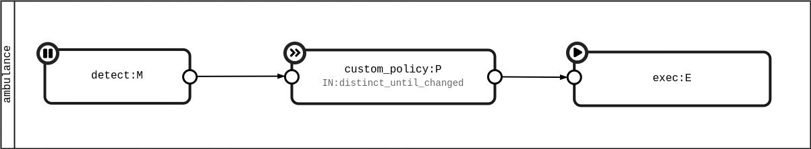

Let's write your first MAPE loop. You'll write a simplified loop of an ambulance that switch on/off the siren and increase speed in case of an emergency detected.

## Ambulance loop

You'll implement this simple `ambulance` loop, composed of 3 connected elements:

* Monitor `detect`
* Planner `custom_policy`
* Executer `exec`

{ .figure }

In the next sections this graphical notation will be more clear.

```python
import mape

mape.init() # (1)

# Ambulance loop definition, named "ambulance"
loop = mape.Loop(uid='ambulance') # (2)

# Monitor element of ambulance loop
@loop.monitor # (3)
def detect(emergency, on_next): # (4)
    on_next(emergency)
```

1.  `#!py mape.init()` accept different params to setup PyMAPE, allowing configuration by a config file and/or directly in the source code.
2.  `uid` is an __unique__ identification for the defined loop. If you don't pass an `uid`, system provide a random one for you.
3.  Decorator create and register the new element monitor to the ambulance `loop`.
4.  The function name `#!py detect` is used as `uid` of our element inside the ambulance loop.

A this point, you have a loop (`ambulance`) made up of a single monitor element called `detect`.

??? info "Loop and Element `uid`"

    Loop uid `ambulance` must be unique in the whole app, instead `detect` (monitor uid) must be so only within the loop to which it belongs. This allow to address an element by its path (eg. `ambulance.detect`). 

`#!py detect()` function is the monitor element. It accepts at least two positional params:

* __stream item__ (`emergency`) - the value in input of an element. The elements talk with each other by streams as [ReactiveX] philosophy.
* __on_next__ - is the function to call with the value to pass to the next linked elements (`#!py subscribed()`). It can be called 0 or N times, you haven't to confused with the function `#!py return`.

[ReactiveX]: https://en.wikipedia.org/wiki/ReactiveX

Go ahead with a `plan` for add policies in case of an emergency detected.

```python
@loop.plan(uid='custom_policy') # (1)
def policy(emergency, on_next, self):
    # Emergency plans
    if emergency is True:
        on_next({'speed': self.emergency_speed}) # (2)
        on_next({'siren': True})
    else:
        on_next({'speed': 80})
        on_next({'siren': False})
                 
policy.emergency_speed = 180
```

1.  Differently from the monitor, here we choose the element `uid` (`custom_policy` instead of `policy`).
2.  Use the object property `emergency_speed` set externally.

In this case, `#!py policy()` has a third param `self`. When you add it to the function signature, you can directly access to the `Element` object behind the scene.

This time, respect previous `#!py detect()`, you pass a `dict` to the next linked element.

The last element defined and registered is the execute element, `exec` applies the plan on the managed system (ie. ambulance), in our case simply print an output.

```python
@loop.execute
def exec(item, on_next):
    if 'speed' in item:
        print(f"Speed: {item['speed']} Km/h")
    if 'siren' in item:
        print(f"Siren is {'ON' if item['siren'] else 'OFF'}")
```

The last step to complete ambulance loop is to connect (`subscribe()`) the three elements:

=== "Subscribe"

    ```python
    detect.subscribe(policy)
    policy.subscribe(exec)
    ```

=== "Pipe"

    ```python
    from mape import operators as ops # (1)
    
    # Alternative way
    detect.pipe(
      ops.through(policy),
      ops.through(exec)
    ).subscribe()
    ```

    1.  `ops` are all the RxPY [operators] plus some more extras.

You are finally ready to try your ambulance emergency system, sending a detected emergency to the monitor element `detect`:

```python
detect(True) # (1)
```

1.  Just call the `#!py detect()` function and pass the item as param.

As you can see, __nothing happens__!

This is the wanted behaviour, because you have to start element `detect` whenever you are ready to receive the stream.

??? info "Different elements behaviour"

    Elements can have 3 different behaviours respect to the stream passing through them:
    
    <!-- Same text in reference/entities.md -->

    * :fontawesome-solid-pause: __manual start__ (_monitor_): the element cannot send or receive items until the `.start()` method invocation. This is often related to internal resource lifetime (eg. DB connection, socket, ...). It allows to connect all loops and elements before start receiving the stream.
    * :fontawesome-solid-forward: __start on subscribe__ (_analyzer, planner_): the element will be started when someone is interested to it (ie. `subscribed()`).
    * :fontawesome-solid-play: __start on init__ (_executer_): the element is ready from its initialization.

So, we start the monitor element and simulate an emergency:

```python
detect.start()
detect(True)
```

Get the results:

    Speed: 180
    Siren is ON

Again, ending the emergency (ie. `False`):

```python
detect(False)
```

Get the results:

    Speed: 80
    Siren is OFF

## Operators

Inspired by the functional programming, there are plenty [operators] available in RxPY and directly usable in PyMAPE. They can be chained in a pipeline, allowing _transformations, combinations, filtering, grouping, error managing, applying conditions, making math operations, and so on_.

There are more than 140 operators (about 400 variants), and we advise and encourage the creation of your custom operators following your need.

### Filters

In the ambulance example there is an issue. If the monitor collect an emergency multiple time, all the following element (planner and executer) are invoked. 

```python
detect(True)
# Speed: 180
# Siren is ON
detect(True)
# Speed: 180
# Siren is ON
# ...
```

??? note "Same on emergency end"

    ```python
    detect(False)
    # Speed: 80
    # Siren is OFF
    detect(False)
    # Speed: 80
    # Siren is OFF
    # ...
    ```

To solve the problem, we can put a `filter` at the __input__ of planner (or the output of monitor):

=== "Element"

    ```python hl_lines="1"
    @loop.plan(uid='custom_policy', ops_in=ops.distinct_until_changed()) # (1)
    def policy(emergency, on_next, self):
        # Emergency plans
        if emergency is True:
            on_next({'speed': self.emergency_speed}) # (2)
            on_next({'siren': True})
        else:
            on_next({'speed': 80})
            on_next({'siren': False})
    ```
    
    1.  Simply use the param `ops_out` to put the operator on output.

=== "Pipe"
    
    ```python hl_lines="3"
    # In alternative we can add filter in the pipe chain
    detect.pipe(
        ops.distinct_until_changed(),
        ops.through(policy),
        ops.through(exec)
    ).subscribe()
    ```

[`#!py distinct_until_changed()`][distinct_until_changed] allows sequence that contains only distinct contiguous item.

??? tip "A better example"

    Ambulance can be not the best example to understand the use of `#!py distinct_until_changed()`, but try to image a monitor that use polling to read state of managed system. The values read can be the same until the system change the state (eg. motion detection, ambient temprature, ...).

[distinct_until_changed]: https://rxpy.readthedocs.io/en/latest/reference_operators.html#reactivex.operators.distinct_until_changed

## Loop and Element access

PyMAPE provide a simplified access to his main entities. For example, you can iterate:

```python
# Iterate over all loops and elements defined in the app
for loop in mape.app:
    print(f"* {loop.uid}")
    for element in loop:
        print(f" - {element.uid}")
```

Returns:

    * ambulance
      - detect
      - custom_policy
      - exec

...or use python _list comprehension_ to retrieve particular elements: 

```python
# Get all execute elements
[element.uid for element in mape.app.ambulance if isinstance(element, mape.Execute)]
```

Returns:

    ['exec']

You can chain the loop and element `uid` (_dot-notation path_) to have direct access to the elements:

```python
mape.app.ambulance.detect
# return monitor detect object
```

Same result is obtained with:
```python
mape.app['ambulance.detect'] # (1)
```

1.  Allowing use of variable as dot-notation path.

## Debug

Some tips for debug your loops, elements crossed by the streams.

### Element

You can print the __in__ and/or __out__ items stream of an element:

=== "In"

    ```python
    element.debug(mape.Element.Debug.IN)
    ```

=== "Out"

    ```python
    element.debug(mape.Element.Debug.OUT)
    ```

=== "In & Out"

    ```python
    from mape import Element
    element.debug(Element.Debug.IN | Element.Debug.OUT)
    ```

=== "Disable"

    ```python
    element.debug() # (1)
    ```
    
    1. `#!py element.debug(Element.Debug.DISABLE)` is equivalent

??? note "Sample debug output"
    `#!py detect(True)`

    return:
    
    ```
    # detect(True)
    Speed: 180
    (9373) on next: {'speed': 180} | in > [ambulance.exec]
    (2472) on next: {'speed': 180} | [ambulance.custom_policy] > out
    Siren is ON
    (9373) on next: {'siren': True} | in > [ambulance.exec]
    (2472) on next: {'siren': True} | [ambulance.custom_policy] > out
    (2073) on next: True | in > [ambulance.custom_policy]
    (2388) on next: True | strem out of detect()
    (2616) on next: True | [ambulance.detect] > out
    ```

    The history order is due the recursive call, on which ReactiveX is based. If necessary this beahviour can be "fixed" in the next realease.

### LogObserver

You can create a fake element (`LogObserver`) and attach it to real element. The `LogObserver` doesn't modify the stream but simply print it.

If you want print all the stream output from the montiro, you can modify the loop subscription of ambulance like this:

```poython hl_lines="1"
detect.subscribe(LogObserver("stream out detect"))
detect.subscribe(policy)
policy.subscribe(exec)
```

??? note "Sample debug output"

    `#!py detect(True)` 

    return:

    ```
    (5393) on next: True | stream out detect
    Speed: 180
    Siren is ON
    ```