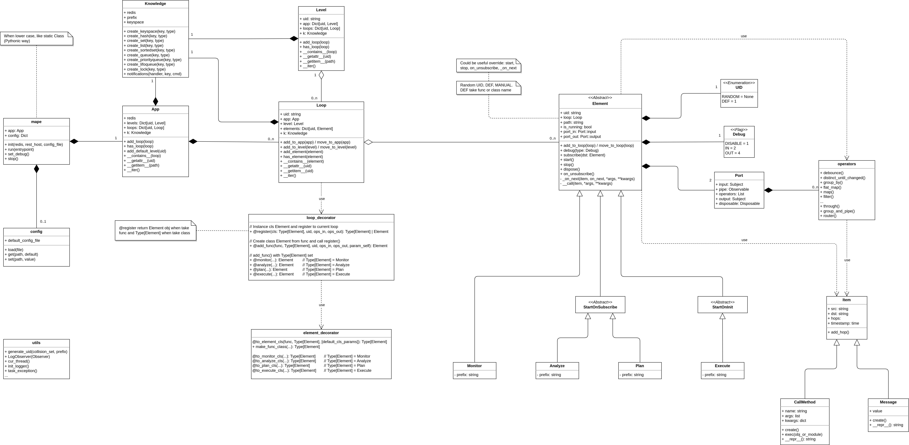

To know the entities that compose PyMAPE, and their relationships, you can see a shrink version of its metamodel.

## Metamodel

{ style="background-color: white;" }

## Entities

Explore the entities (used to develop your loops), starting from left to right:

* `mape` package allows the configuration by `#!py init()` method and also by a config file (default: `mape.yml` in your working directory) or a mix of both. `#!py init()` has priority over the file. From `mape` you have direct access to `app` and `config`.
* `config` dict exposes all your configuration (eg. `#!py mape.config['debug']`), and you can also use it for your purpose, putting what you want in the configuration file.
* `App` gives access to all declared MAPE loops, levels, and the global Knowledge
* `Loop` is identified by a uid, contains its Element, has its Knowledge, and give access to the main `app` object (ie. `loop.app`) and its level (if exists).
* `Level` is optional (there is an empty one by default), It can be used to describe a hierarchical control pattern. At each level with its uid can be associated more loops.
* `Element` (ie. M, A, P, E) is the pillar of PyMAPE framework, the center of the metamodel. They have an uid, but must be unique only inside its loop. There are different kinds of elements (_Monitor, Analyze, Plan, Execute_) and relative behaviors (_base, StartOnSubscribe, StartOnInit_). It has two ports (in and out), that allow to put within a stream. The operators can be added in the ports itself, or between elements (in the operators pipe).
* There are three different `Knowledge`, with different scopes (App, Level, and Loop). You can access each of them from its object (eg. `#!py loop.k`). You can use it like a local storage object, or as centralized memory shared by the app deployed on a different machine (using redis).
* `operators` are the ones defined in the ReactiveX standard enriched with some specific and useful to our purpose.
* The classes `Message` and `CallMethod` can be used as items of the stream, enriched with additional information in the payload. This allows addressing our stream give at each item a destination or applying some kind of routing algorithm (`Message`), like the IP packets. The `CallMethod` item allows calling the remote methods (of elements) using the stream.
* you have already seen the `loop_decorator` in the [First loop] section, used to register elements to a loop.
* `element_decorator` provides a set of decorators to define the Element class starting from a simple function. These decorators (as the above) are syntactic sugar to speed up development.

!!! info

    Please refer to the [First loop] section and the following sections, to see how and when these entities are used.

[First loop]: ../first-loop.md