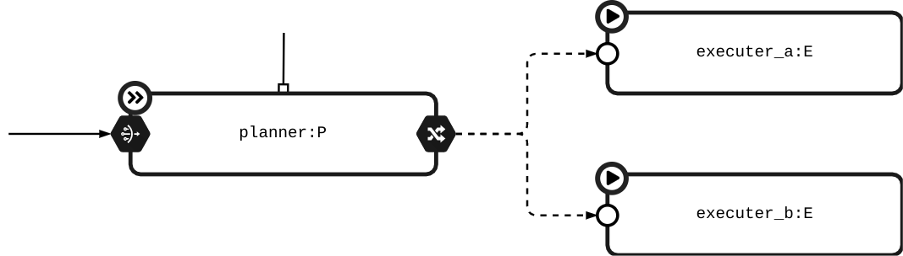

The introduced graphical notation tries to describe the different PyMAPE entities (_Loop, Element, Stream, Knowledge, operators, etc_), their connections and interactions. 
It also add expressiveness to describe the loop distribution on different devices.

You'll recognize something from UML, BPMN and [Weyns's notation][weyns paper].

## Entities

{ .figure }

The Knowledge can have different scope: __App, Level and Loop__.   

{ .figure .center style="width: 700px" }

When you have multiple instance of the same object/device, can be used the placeholder `{var}`, parametrizing the element uid. 

{ .figure .center style="width: 500px" }

In this particular case, we have many loops with uid `tank_{name}` (eg. `tank_foo`), with inside a monitor element (eg. `foo_level`).

## Connections

The __local__ and __remote__ communication is described in the next figure. It allows intra and extra loop communication.

{ .figure }

The _Connection lines_ can be also used to represent the cardinality of entities. The _Remote/Routed Message_ are existent connections, but not defined in the source code. This happens using source/sink as the _Network stream communication and/or the _Connection operator_.

In the last image you can see a simple instance where the `planner` uses the _Router_ (dispatching the items to the executers) and _Group & Pipe_ (group item by a condition and apply some pipe operators). There is also a _Call Method_ link in the planner.

{ .figure .center style="width: 600px" }