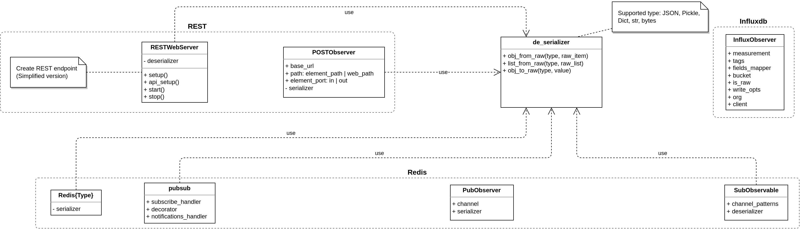
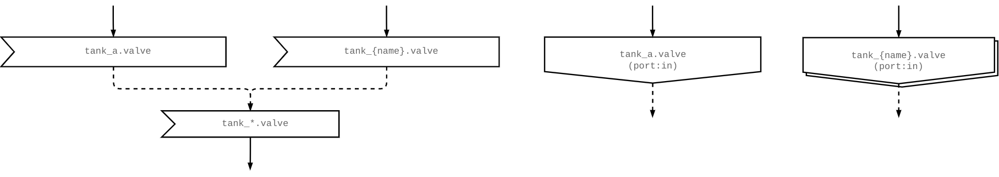
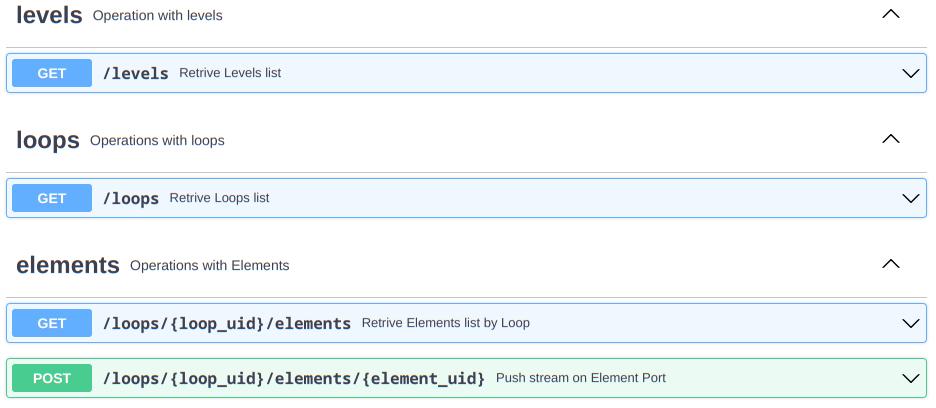
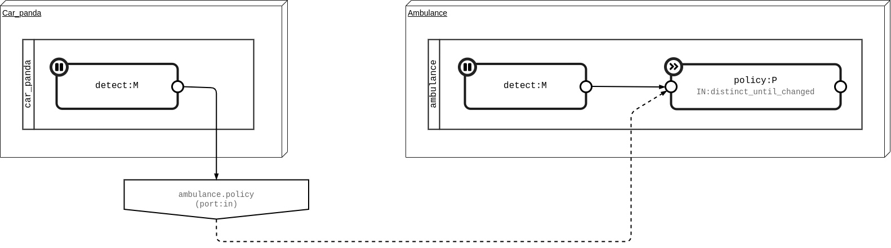
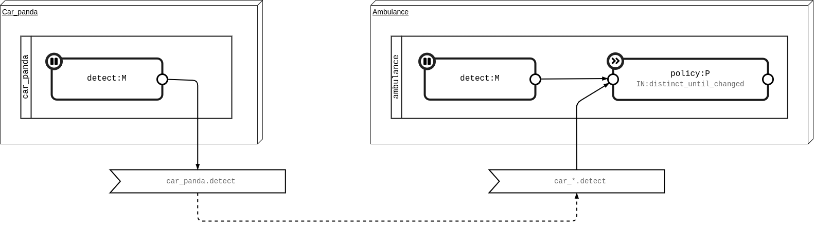
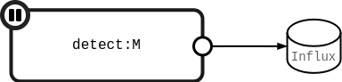

One important point of PyMAPE is the capability of decentralize (functionalities and data) and distribute loops on more devices. These features are reached by the remote package.

## Class diagram

PyMAPE tries to preserve the best flexibility to the user design choices. You know pros and cons of different communication architect based on __request-response__ (eg. polling) respect to __publish-subscribe__ (eg. data centralization). So there are some domains (and patterns) that prefer one approach over the other, or again hybrid one to exploit the advantage of each one.  

You can choose between:

* __RESTful__ implementation, allowing reading and writing access to the elements of your application
* __Redis__ as DB and message broker, allowing the communication between elements and also as shared memory (`Knowledge`) for distribute nodes.

{ .figure }

???+ info "Observable and Observer"

    In the class diagram there are some class with the post-fix ["Observer" and "Observable"][observable contract], key concepts in the ReactiveX library. Also the element ports use the same idea. You can think them as sink and source for your stream. 

### Graphical Notation

{ .figure }

## REST

For enable the REST support you have to provide an `host:port` for the web server ([Uvicorn] used by [FastAPI]). For do that you can:

=== "init()" 

    ```python
    mape.init(rest_host_port="0.0.0.0:6060")
    ```

=== "mape.yml"

    ```yaml
    rest:
        host_port: 0.0.0.0:6060
    ```

Now you can get information about levels, loops, ad elements defined in your app, but mainly you can push items to any element port through a POST request (`POSTObserver` class).  

??? note "API documentation"

    API documentation and a web ui for test is available:
    
    * OpenAPI: [/openapi.json](http://0.0.0.0:6060/openapi.json)
    * Swagger: [/docs](http://0.0.0.0:6060/docs)
    * ReDoc: [/redoc](http://0.0.0.0:6060/redoc)
    
    Thanks to the [FastAPI] library.
    
    { .figure }

* `#!py POSTObserver(base_url, path, port, serializer, session)` 

    It behaves like a sink, sending the stream to the `host:port` device selected and element selected by the path.

    `base_url: str`
    
    :   In the format `host:port` of the REST API web server target.
    
    `path: str`
    
    :   Element path (`loop_uid.element_uid`) target
    
    `port: Port = Port.p_in`
    
    :   Destination port where inject the stream
    
    `serializer = None`

    `session: aiohttp.ClientSession = None`

### Example

In the following example you see a communication between two distributed devices (`Car_panda` and `Ambulance`), specifically between the port out of `detect` element of `car_panda` (`car_panda.detect`) and port in of `policy` element of `ambulance` (`ambulance.policy`).

{ .figure }

Translated in python on device `Car_panda`

```python
from mape.remote.rest import POSTObserver

car = mape.Loop(uid='car_panda')

@car.monitor
def detect(item, on_next):
  ...

# Create the sink
ambulance_policy = POSTObserver("http://0.0.0.0:6060", "ambulance.policy")
# Connect detect to the sink
detect.subscribe(ambulance_policy)
```

and device `Ambulance`

```python
# Enable REST support
mape.init(rest_host_port="0.0.0.0:6060")

ambulance = mape.Loop(uid='ambulance')
...
@ambulance.plan(ops_in=ops.distinct_until_changed())
def policy(item, on_next):
    ...  
```

## Redis

For enable the [Redis] support you have to provide an url for your instance `redis://localhost:6379`. For do that you can:

=== "init()"

    ```python
    mape.init(redis_url="redis://localhost:6379")
    ```

=== "mape.yml"

    ```yaml
    redis:
        url: redis://localhost:6379
    ```

??? note "Redis instance"

    PyMAPE doesn't provide (yet) an instance of [Redis] so you have to run your own, for example using a docker container:

    ``` {.console .termy}
    $ docker run --name mape-redis -p 6379:6379 -v $(pwd)/docker/redis:/usr/local/etc/redis --rm redis redis-server /usr/local/etc/redis/redis.conf
    oO0OoO0OoO0Oo Redis is starting oO0OoO0OoO0Oo
    Redis version=6.2.6, bits=64, commit=00000000, modified=0, pid=1, just started
    Configuration loaded
    * monotonic clock: POSIX clock_gettime
    * Running mode=standalone, port=6379.
    Server initialized
    ```

Redis unlike REST have two class to allow stream communication (on distributed devices): `PubObserve` e `SubObservable`. 

This mean that you have to choose a channel name, and publish/subscribe a stream on it.

??? tip "Pattern matching"

    [Redis] supports channel pattern matching, allowing multi-points communication.

    * `car_?.detect`: can receive from `car_a.detect`, `car_b.detect`, etc...
    * `car_[xy].detect`: can receive only from `car_x.detect`, `car_y.detect`
    * `car_*`: can receive from `car_foo`, `car_bar`, etc...

### Example

Let's implement the previous example with [Redis].

{ .figure }

Translated in python on device `Car_panda`

```python
from mape.remote.redis import PubObserver
# Enable Redis support
mape.init(redis_url="redis://localhost:6379")

car = mape.Loop(uid='car_panda')

@car.monitor
def detect(item, on_next):
  ...

# Publish detect output on channel named "car_panda.detect"
detect.subscribe(PubObserver(detect.path))
```

and device `Ambulance`

```python
from mape.remote.redis import SubObservable
# Enable Redis support
mape.init(redis_url="redis://localhost:6379")

ambulance = mape.Loop(uid='ambulance')
...
@ambulance.plan(ops_in=ops.distinct_until_changed())
def policy(item, on_next):
    ...

# Subscribe to others cars 
# note: for clarity can be used "policy.port_in"
SubObservable("car_*.detect").subscribe(policy) # (1)
```

1. if you have access to car detect element you can use `#!py f"car_*.{detect}" == f"car_*.{detect.uid}"`

## Knowledge

[Redis] provides a collection of native [data types][redis data types] (_Strings, lists, Sets, Hashes, Sorted Sets_) and thanks to the [redis-purse] library we extend with _Queue_ (FIFO, LIFO and Priority) and distributed Lock. The access to types is implemented by non-blocking I/O operation (async/await).

??? tip "Async element definition"

    You can trasparently add `#!py async` in front of your element defintion, allowing use `#!py await` (as for [redis-purse]).  

    ```python
    @loop.monitor
    async def detect(emergency, on_next):
      await coroutine()
      ...
    ```

### Example

Create and access to the `cars` _Set_ in the global Knowledge.

```python
# Create a Set in the global Knowledge (type string)
k_cars = mape.app.k.create_set("cars", str)
# Clean Set before
await k_cars.clear()
...

# Different device and base code
@loop.analyze
async def cars_store(car, on_next, self):
    if not hasattr(self, 'k_cars'):
      # Get access to the same Set
      self.k_cars = self.loop.app.k.create_set("cars", str)
    
    # Add {car.name} to the Set
    await self.k_cars.add(car.name)
    # Count cars in the Set
    car_count = await self.k_cars.len()
    on_next(car_count)
```

Attach and handler (`#!py on_cars_change()`) called on change in the `cars` _Set_.

```python
def on_cars_change(message): # (1)
  ...

# Register handler for add (sadd) / remove (srem) cars
self.loop.app.k.notifications(on_cars_change, 
                              "cars",
                              cmd_filter=('sadd', 'srem'))
```

1. Simply define as `#!py async def on_cars_change(message)` if you need. `#! notifications()` is smart to understand.

## InfluxDB

As for [REST](#rest) and [Redis](#redis), you have to configure it before use (no config by `#!py mape.init()` is available).

```yaml
influxdb:
    url: http://localhost:8086
    username: user
    password: qwerty123456
    org: your-organization
    bucket: mape
    token: <GENERATE_OR_TAKE_FROM_CONFIG_YAML>
    debug: false
```

??? note "InfluxDB instance"

    PyMAPE doesn't provide (yet) an instance of [InfluxDB] so you have to run your own, for example using a docker container:

    ``` {.console .termy}
    docker run --name mape-influxdb -p 8086:8086 \
    -v $(pwd)/docker/influxdb/data:/var/lib/influxdb2 \
    -v $(pwd)/docker/influxdb/conf:/etc/influxdb2 \
    -e DOCKER_INFLUXDB_INIT_MODE=setup \
    -e DOCKER_INFLUXDB_INIT_USERNAME=user \
    -e DOCKER_INFLUXDB_INIT_PASSWORD=qwerty123456 \
    -e DOCKER_INFLUXDB_INIT_ORG=univaq \
    -e DOCKER_INFLUXDB_INIT_BUCKET=mape \
    -e DOCKER_INFLUXDB_INIT_RETENTION=1w \
    -e DOCKER_INFLUXDB_INIT_ADMIN_TOKEN=*TOKEN* \
    --rm influxdb:2.0
    
    ---> 100%
    ```

Now you can use the class `InfluxObserver`, a sink to publish stream in [InfluxDB].

### Example

{ .figure .center style="width: 300px" }

=== "Auto"

    ```python
    from mape.remote.influxdb import InfluxObserver
    
    # Store detect output 
    detect.subscribe(InfluxObserver())
    ```

=== "Fields mapper"

    ```python
    from mape.remote.influxdb import InfluxObserver

    detect.subscribe(
      # All args are optional
      InfluxObserver(
        measurement="car",
        tags=("custom-tag", "value"),
        fields_mapper=lambda item: (item.type, item.value)
      )
    )
    ```

#### ::: mape.remote.influxdb.InfluxObserver
    options:
      show_root_heading: true
      show_root_full_path: true
      show_signature: true
      show_signature_annotations: true

[InfluxObserver][mape.remote.influxdb.InfluxObserver]

--8<-- "docs/append.md"